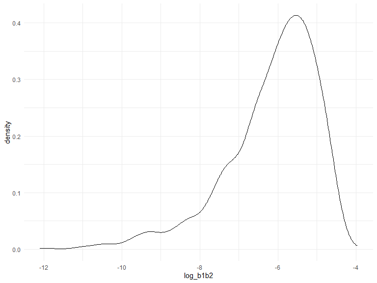

p8105_hw6_sc5126
================
Si Chen
2023-12-02

## Question 2

# Load data

``` r
weather_df = 
  rnoaa::meteo_pull_monitors(
    c("USW00094728"),
    var = c("PRCP", "TMIN", "TMAX"), 
    date_min = "2022-01-01",
    date_max = "2022-12-31") |>
  mutate(
    name = recode(id, USW00094728 = "CentralPark_NY"),
    tmin = tmin / 10,
    tmax = tmax / 10) |>
  select(name, id, everything())
```

    ## Registered S3 method overwritten by 'hoardr':
    ##   method           from
    ##   print.cache_info httr

    ## using cached file: C:\Users\Chanc\AppData\Local/R/cache/R/rnoaa/noaa_ghcnd/USW00094728.dly

    ## date created (size, mb): 2023-12-02 18:34:58 (8.561)

    ## file min/max dates: 1869-01-01 / 2023-11-30

# Bootstrap $\hat{r}^2$

``` r
bootstrap_r2 = 
  weather_df %>%  
  modelr::bootstrap(n=5000) %>%  
  mutate (
    models = map(strap, \(df) lm(tmax ~ tmin + prcp, data=df)),
    results = map(models,  broom::glance) 
  ) %>%  
  select(-strap, -models) %>%  
  unnest(results) %>%  
  select(r.squared)
```

``` r
bootstrap_r2 %>% 
  ggplot(aes(x = r.squared)) + geom_density()
```


Here the $\hat{r}^2$ value we derived is high. It has a mean of
0.9173115. the bootstrap values of $\hat{r}^2$ ranges from 0.8589792 to
0.953366. It can be concluded that `tmin` and `prcp` explained `tmax`
decently.

# The 95% intervel for $\hat{r}^2$

``` r
bootstrap_r2 %>%  
  summarize(
    ci_lower = quantile(r.squared, 0.025), 
    ci_upper = quantile(r.squared, 0.975))
```

    ## # A tibble: 1 × 2
    ##   ci_lower ci_upper
    ##      <dbl>    <dbl>
    ## 1    0.889    0.941

## Bootstrap $\log(\beta_1 * \beta2)$

``` r
bootstrap_logb1b2 = 
  weather_df %>% 
  modelr::bootstrap(n = 5000) %>% 
  mutate(
    models = map(strap, \(df) lm(tmax ~ tmin + prcp, data=df)),
    results = map(models, broom::tidy)
    ) %>% 
  select(-strap, -models) %>% 
  unnest(results) %>% 
  select(id = `.id`, term, estimate) %>% 
  pivot_wider(
    names_from = term, 
    values_from = estimate
    ) %>% 
  rename(
    beta0 = `(Intercept)`, 
    beta1 = tmin,
    beta2 = prcp
    ) %>% 
  mutate(
    log_b1b2 = log(beta1 * beta2)
    )
```

``` r
 bootstrap_logb1b2 %>% 
  ggplot(aes(x = log_b1b2)) + geom_density()
```



Here the distribution of $\log(\beta_1 * \beta2)$ is skewed to the left.

The $\log(\beta_1 * \beta2)$ value we derived has a mean of NaN. the
bootstrap values of $\log(\beta_1 * \beta2)$ ranges from NaN to NaN.

# The 95% intervel for $\log(\beta_1 * \beta2)$

``` r
bootstrap_logb1b2 %>%  
  summarize(
    ci_lower = quantile(log_b1b2, 0.025, na.rm = TRUE), 
    ci_upper = quantile(log_b1b2, 0.975, na.rm = TRUE))
```

    ## # A tibble: 1 × 2
    ##   ci_lower ci_upper
    ##      <dbl>    <dbl>
    ## 1    -9.17    -4.57

## Question 3
