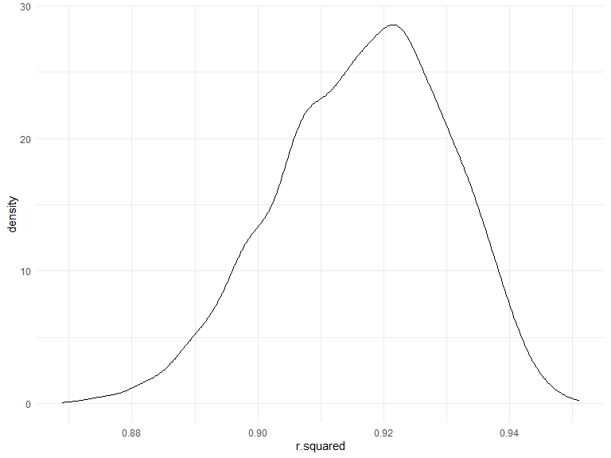

p8105_hw6_sc5126
================
Si Chen
2023-12-02

``` r
library(tidyr)
library(tidyverse)
library(rvest)
library(viridis)
library(patchwork)
library(olsrr)
library(mgcv)
library(modelr)


knitr::opts_chunk$set(
    echo = TRUE,
    warning = FALSE,
    fig.width = 8, 
  fig.height = 6,
  out.width = "90%"
)

theme_set(theme_minimal() + theme(legend.position = "bottom"))

options(
  ggplot2.continuous.colour = "viridis",
  ggplot2.continuous.fill = "viridis"
)

scale_colour_discrete = scale_colour_viridis_d
scale_fill_discrete = scale_fill_viridis_d
```

## Question 2

``` r
weather_df = 
  rnoaa::meteo_pull_monitors(
    c("USW00094728"),
    var = c("PRCP", "TMIN", "TMAX"), 
    date_min = "2022-01-01",
    date_max = "2022-12-31") |>
  mutate(
    name = recode(id, USW00094728 = "CentralPark_NY"),
    tmin = tmin / 10,
    tmax = tmax / 10) |>
  select(name, id, everything())
```

    ## Registered S3 method overwritten by 'hoardr':
    ##   method           from
    ##   print.cache_info httr

    ## using cached file: C:\Users\Chanc\AppData\Local/R/cache/R/rnoaa/noaa_ghcnd/USW00094728.dly

    ## date created (size, mb): 2023-12-02 18:34:58 (8.561)

    ## file min/max dates: 1869-01-01 / 2023-11-30

``` r
bootstrap_r2 = 
  weather_df %>%  
  modelr::bootstrap(n=5000) %>%  
  mutate (
    models = map(strap, \(df) lm(tmax ~ tmin + prcp, data=df)),
    results = map(models,  broom::glance) 
  ) %>%  
  select(-strap, -models) %>%  
  unnest(results) %>%  
  select(r.squared)
```

``` r
bootstrap_r2 %>% 
  ggplot(aes(x = r.squared)) + geom_density()
```


Here the $\hat{r}^2$ value we derived is high. It has a mean of
0.9168647. the bootstrap values of $\hat{r}^2$ ranges from 0.8578229 to
0.9515823. It can be concluded that `tmin` and `prcp` explained `tmax`
decently, and since the shape of r2 distribution is not very symmetric,
we shouldn’t simply use mean +/- 1.96 \* the standard error to construct
the confidence interval for $R^2$. We can calculate the 2.5% and 97.5%
quantile of the estimates across bootstrap samples instead.

## Question 3
